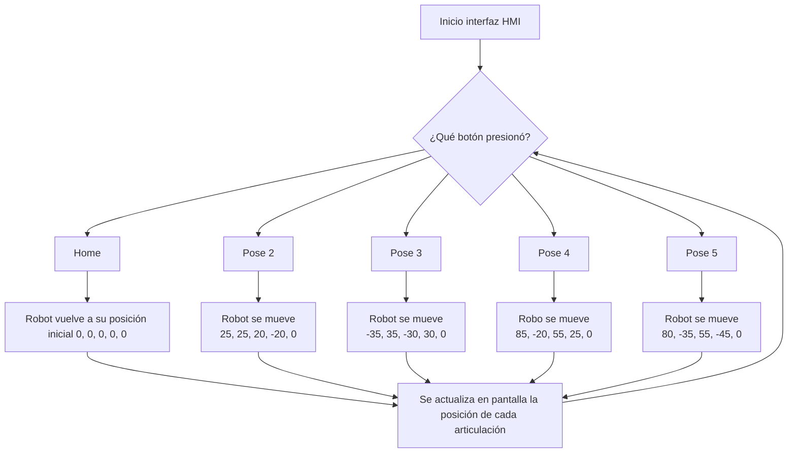

# Laboratorio No. 04 - 2025-I - Cinemática Directa - Phantom X - ROS

El objetivo de esta práctica de laboratoria es aprender a controlar los Joint Controllers de ROS para manipular los servomotores Dynamixel AX-12 del robot Phantom X Pincher a fin de ubicarlo en cualquier pose predeterminada a partir de los valores de sus ángulos en las articulaciones, adicionalmente diseñar un HMI que tuviera las distintas poses para elegir, que también mostrase la información de las articulaciones y la información de los integrantes del grupo.

## Representación del Robot Phantom X Pincher
<p align="center">
   <br> 

<p align="center">
   <br> 

| i | $\theta_i$ | $d_i$ | $a_i$ | $\alpha_i$ | Offset |
|:-:|:-------:|:---:|:---:|:-------:|:------:|
| 1 | $\theta_1$ |  51 |  0  |   $\pi$/2  |    0   |
| 2 | $\theta_2$ |  0  | 110 |    0    |  $\pi$/2  |
| 3 | $\theta_3$ |  0  | 108 |    0    |    0   |
| 4 | $\theta_4$ |  0  |  0  |   $\pi$/2  |  $\pi$/2  |
| 5 | $\theta_5$ |  77 |  0  |    0    |    0   |

## Configuraciones del Robot

Durante el desarrollo del laboratorio, se observó que una de sus articulaciones no se movió de manera esperada, esto se le atribuye a la enorme latencia que es introducida por el uso de una máquina virtual en medio del proceso de control, el proceso de comunicación es directamente afectado, por lo que a pesar de que los comandos de control estén bien ejecutados, la articulación no respondió oportunamente o inclusó ignoro el comando al llegar en tiempos no esperados por el robot.

### Home

En la posición de home todos los valores articulares del pincher tienen un valor de 512 que representa la mitad del rango que tienen los 5 servomotores Dynamixel con lo cual el vector q en esta pose se define como:

$$q=<0,0,0,0,0>$$

Con lo cual nos queda el siguiente diagrama del Robot usando el RVCTools de Peter Corke:

<p align="center">
   <br> 


<p align="center">
  
</p>

### Pose 1

La primera pose tiene los siguientes valores artículares en bits con respecto a la posición de home:

$$q=<25,25,20,-20,0>$$

Con lo cual nos queda el siguiente diagrama del Robot usando el RVCTools de Peter Corke:

<p align="center">
   <br> 

<p align="center">
  
</p>

### Pose 2

La segunda pose tiene los siguientes valores artículares en bits con respecto a la posición de home:

$$q=<-35,35,-30,30,0>$$

Con lo cual nos queda el siguiente diagrama del Robot usando el RVCTools de Peter Corke:

<p align="center">
   <br> 

<p align="center">
  
</p>


### Pose 3

La tercera pose tiene los siguientes valores artículares en bits con respecto a la posición de home:

$$q=<85,-20,55,25,0>$$

Con lo cual nos queda el siguiente diagrama del Robot usando el RVCTools de Peter Corke:


<p align="center">
   <br> 

<p align="center">
  
</p>

### Pose 4

La cuarta pose tiene los siguientes valores artículares en bits con respecto a la posición de home:

$$q=<80,-35,55,-45,0>$$

Con lo cual nos queda el siguiente diagrama del Robot usando el RVCTools de Peter Corke:


<p align="center">
   <br> 


<p align="center">
  
</p>

## Plano e imagen desde vista superior de la planta donde esta el Phantom Pincher

### Plano de la planta
<p align="center">
  
</p>

### Vista superior de la planta
<p align="center">
  
</p>

## Control del Phantom Pincher

Antes de poder controlar el phantom, se deben instalar todas las librerías que controlan los servomotores, para ello se debe ejecutar el siguiente comando en una terminal que ya esté configurada con la ruta del ROS:

```bash
sudo apt update
sudo apt install ros-humble-dynamixel-sdk
```

Una vez tenemos instalada la librería, creamos un paquete que nos permita acceder a los servicios del Phantom:

```bash
cd ~/Lab_Robotica/ros2_ws/phantom_ws/src
ros2 pkg create pincher_control --build-type ament_python --dependencies rclpy sensor_msgs dynamixel_sdk
```

En dicho paquete creamos un archivo ``control_servo.py`` en la carpeta ``pincher_control/pincher_control/`` con el cual podemos controlar las posiciones de los servomotores y fijar sus parámetros de movimiento como el torque máximo, la velocidad de operación y el tiempo de espera entre los movimientos de cada servomotor. Para este caso particular, dichos parámetros se ajustaron en 600, 100 y 0.5 s respectivamente. Este archivo a su vez es un nodo que se suscribe al tópico ``/phantom/joint_target`` desde el cual recibe y ejecuta las posiciones objetivo que le envíen desde el HMI y publica un tópico ``/phantom/joint_states`` para que en el HMI se muestren los valores de las articulaciones.

Una vez se tenga el archivo completo, se debe modificar el atributo ``entry_points`` dentro del ``setup.py`` para que incluya la ruta del ejecutable: 

```python
entry_points={
        'console_scripts': [
            'control_servo = pincher_control.control_servo:main',
        ],
    }

```

### Funciones mas importantes utilizadas
```python
send_relative_pose(self, delta)
```
Es una función del nodo ROS, lo que hace es envíar las posiciones para las articulaciones del robot sumando el desplazamiento delta a la posición base, en este caso (home_pose), esto lo hace creando un mensaje JointState y publicandolo en el tópico /phantom/joint_target.
```python
joint_callback(self, msg)
```
Está función recibe el estado actual de las articulaciones, guarda las posiciones en self.latest_joint_positions y actualiza la pantalla con los valores actuales.

```python
update_joint_labels(self, positions)
```
Es la función que se encarga de actualizar los textos de las etiquetas que muestran la posición actual de cada articulación.

Para ejecutar el controlador se debe ejecutar el siguiente comando en una terminal que ya haya compilado el paquete:
```bash
ros2 run pincher_control control_servo
```

## Creación de la Interfaz de Usuario (HMI)

La creación del HMI es muy similar a la del controlador del Phantom Pincher, puesto que se debe crear un paquete que contenga los botones y otro elementos requeridos para enviar información:

```bash
cd ~/Lab_Robotica/ros2_ws/phantom_ws/src
ros2 pkg create phantom_hmi --build-type ament_python --dependencies rclpy sensor_msgs PyQt5
```

Posteriormente editamos el archivo ``package.xml`` y añadimos estas lineas de código:

```xml
<exec_depend>rclpy</exec_depend>
<exec_depend>sensor_msgs</exec_depend>
<exec_depend>PyQt5</exec_depend>
```

Una vez se tenga editado ello, añadimos un archivo ``hmi_main.py`` dentro de la carpeta ``phantom_hmi/phantom_hmi/``, en dicho archivo creamos los 5 botones requeridos para cada pose, colocamos un título para el HMI, un texto con nuestros nombres y un texto variable que permita recibir la información del tópico al que se suscribió que es el ``/phantom/joint_states`` y envía la posición de cada uno de los servomotores del robot. A su vez el HMI debe publicar el tópico ``/phantom/joint_target`` para enviarle la información de la pose solicitada al robot.

Al igual que sucede con el controlador, se debe modificar el atributo ``entry_points`` dentro del ``setup.py`` para que incluya la ruta del ejecutable:

```python
entry_points={
        'console_scripts': [
            'hmi_gui = phantom_hmi.hmi_gui:main',
        ],
    }

```

Para ejecutar el HMI se debe ejecutar el siguiente comando en una terminal que ya haya compilado el paquete:

```bash
ros2 run phantom_hmi phantom_hmi
```

## [Video explicativo del trabajo realizado](https://drive.google.com/file/d/163RWanmiTWWNt5xJiaSZYgJFdOw2tVGp/view?usp=sharing)

## [Video del funcionamiento en el lab](https://drive.google.com/file/d/1lBSTGnlAyypW5a2xq-HKPlrpWfFHm7JT/view?usp=sharing)
