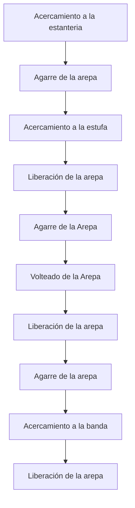
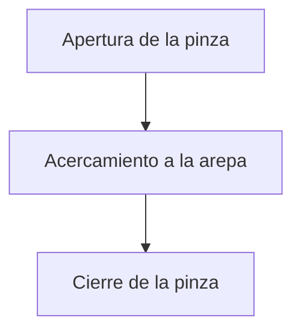
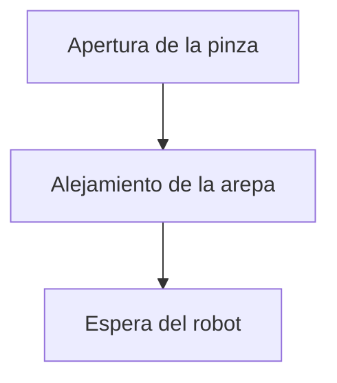

# Proyecto Robótica Industrial - Automatización del Proceso de Preparación de Arepas
En este informe se describe el proceso de desarrollo de un sistema robótico para automatizar el proceso de preparación de arepas, para ello se detalla el proceso de diseño y construcción de un gripper para que el robot ABB IRB-140 agarre las arepas de una mesa, las coloque en una parrilla, las voltee una vez estén cocidas y las recoja de la parrilla una vez estén totalmente cocinadas; a su vez se describe el proceso de generación de trayectorias para que el robot se acerque a las arepas, las tome, las voltee y las deje en los lugares deseados.

## Diseño del Gripper y las Arepas

En primer lugar se diseñó el mecanismo del gripper, para ello se propusieron algunos bocetos del mecanismo que abría y cerraba una pinza mediante el accionamiento de un gripper electroneumático MCHA-20, estas fueron algunas de las opciones propuestas: 

     

     

Se terminó optando por la segunda opción dado que permitía el ajuste en la apertura máxima y el cierre mínimo del gripper con tan solo modificar la distancia de los eslabones que componen el mecanismo, con lo cual el siguiente paso fue determinar la longitud de cada uno de los eslabones que componen el mecanismo, para ello se empleó el software de Inventor y por medio del modelado por boceto con una serie de iteraciones se halló la siguiente configuración óptima de longitudes de eslabones que permitía un cierre adecuado para el agarre de las arepas:

     

Consiguientemente, se diseñó la pinza que agarraría las arepas, esta debía tratar a las arepas con suavidad para evitar que se desarmen y debía evitar que se desplazaran horizontalmente cuando el gripper se cerrara para garantizar un correcto agarre de la arepa. Al igual que con el mecanismo, se propusieron algunos bocetos para garantizar la función deseada:

     

     

El diseño electo fue la primera opción dado que reducía considerablemente el desplazamiento de la arepa al momento del cierre y evitaba que la arepa se cayera de la pinza cuando se volteara de la estufa. Posteriormente, se modelaron todas las piezas que componen el mecanismo:

     

     

     

     

     

Una vez se terminó el modelado de las piezas, se ensamblaron con el software Inventor de la siguiente forma:

     

Finalmente, se imprimieron todas las pezas que componen todo el mecanismo con filamento de PLA en una impresora 3D y se ensamblaron con tornillos de 3 mm de diámetro: 

     

     

El modelo de arepas usadas fueron arepas circulares de 6, 7 cm de radio, y unas arepas cuadradas de 5 cm de lado, aunque se imprimieron en 3D, finalmente se usaron arepas reales envueltas en aluminio:

     

    

## Distribución del Espacio

Para la distribución del espacio de trabajo, se tuvo que crear una repisa en la que las arepas iban a permanecer, se tenía que construir una estufa para asar las arepas y posteriormente la banda para servirlas, por facilidad y espacio del laboratorio, se unieron las estructuras de la repisa y la estufa, se puso un espacio considerable entre la mesa para diferenciar cada estación, la siguiente imagen es la estructura que funge como estufa y la repisa:

     

Luego se tiene la banda transportadora: 

     

Una vista superior de la planta de RobotStudio con los objetos utilizados se ve de la siguiente forma:

     

## HMI- Human-Machine Interface

Para la creación del HMI se hizo uso de una herramienta integrada en RobotStudio que permite diseñar interfaces gráficas personalizadas para los FlexPendant de los robots ABB, la herramienta facilita el proceso, debido a que deja a un simple switch el manipular la arepa, adicionalmente tiene leds para indicar al usuario que acción ya fue realizada, como el de selección de arepa, para el caso de voltearlas y servirlas se puede usar más de una vez.

     

## Secuencia General de Movimientos

La secuencia general del movimiento se detalla en el siguiente diagrama de flujo:

Mientras que el proceso de agarre de la arepa se presenta a continuación:

A su vez el proceso de liberación de la arepa se muestra a continuación:

